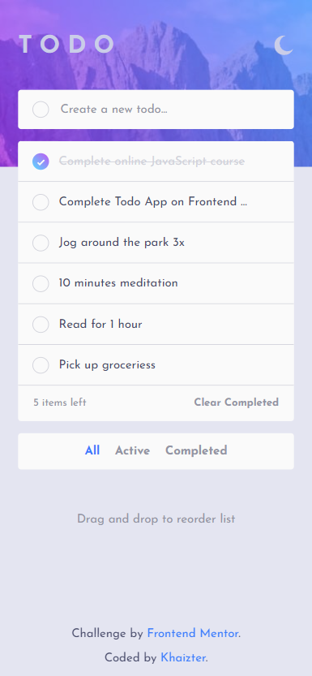

# Frontend Mentor - Todo app solution

This is a solution to the [Todo app challenge on Frontend Mentor](https://www.frontendmentor.io/challenges/todo-app-Su1_KokOW). Frontend Mentor challenges help you improve your coding skills by building realistic projects.

## Table of contents

- [Overview](#overview)
  - [The challenge](#the-challenge)
  - [Screenshot](#screenshot)
  - [Links](#links)
- [My process](#my-process)
  - [Built with](#built-with)
  - [What I learned](#what-i-learned)
  - [Continued development](#continued-development)
- [Author](#author)

**Note: Delete this note and update the table of contents based on what sections you keep.**

## Overview

### The challenge

Users should be able to:

- View the optimal layout for the app depending on their device's screen size
- See hover states for all interactive elements on the page
- Add new todos to the list
- Mark todos as complete
- Delete todos from the list
- Filter by all/active/complete todos
- Clear all completed todos
- Toggle light and dark mode
- **Bonus**: Drag and drop to reorder items on the list

### Screenshot

### Links

- Solution URL: [Github](https://github.com/khaizter/todo-app)
- Live Site URL: [Netlify](https://todo-khaizter.netlify.app/)

## My process

### Built with

- Semantic HTML5 markup
- Flexbox
- Mobile-first workflow
- [React](https://reactjs.org/) - Front End Framework
- [React Context](https://reactjs.org/docs/context.html) - State Management
- [Block Element Modifier](http://getbem.com) - Classes Convention
- [Syntactically Awesome Style Sheets](https://sass-lang.com/) - CSS Preprocessor
- [React Beautiful DND](https://github.com/atlassian/react-beautiful-dnd) - Drag and Drop Library
- [Framer Motion](https://www.framer.com/motion/) - Animation Library
- [Node JS](https://nodejs.org/en/) - Back-End Server
- [Express](https://expressjs.com/) - Node JS framework
- [Mongo DB](https://www.mongodb.com/) - Database Solution (NoSQL)

### What I learned

- React Hook useContext
- React Beatiful DND
- Framer Motion
- Animation Practices
- Theme Switching (Dark/Light)
- Some Attribute Selectors
- Developing REST API using Node JS and Express
- Mongo DB and Object-relational Mapping(ORM)
- Authentications, Cookies, JSON Web tokens

### Continued development

- Multiple todo list per user
- Edit text of task
- Auto save or Auto sync

## Author

- Frontend Mentor - [@khaizter](https://www.frontendmentor.io/profile/khaizter)
- Github - [@khaizter](https://github.com/khaizter)
